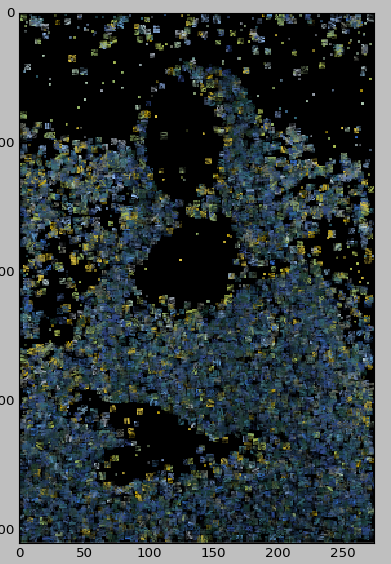
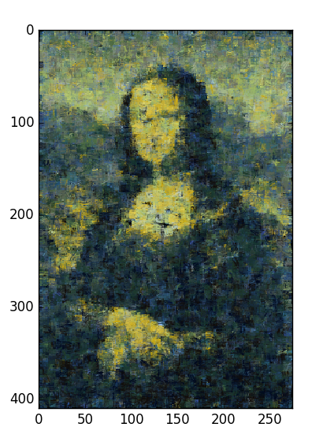

**********
Evaluation
**********

Examples of generated images
============================

This section presents a few images that were created using our system.

Single image in the inspiring set
---------------------------------

In this run, each agent was given the same image 
`Vincent van Gogh - Starry Night <https://upload.wikimedia.org/wikipedia/commons/thumb/e/ea/Van_Gogh_-_Starry_Night_-_Google_Art_Project.jpg/1280px-Van_Gogh_-_Starry_Night_-_Google_Art_Project.jpg>`_. The simulation was run with 5 agents for 10 000 steps. An agent picked a spot for its stroke randomly.

Multiple images in the inspiring set
------------------------------------

In this run, the agents received the image `Vincent van Gogh - Starry Night <https://upload.wikimedia.org/wikipedia/commons/thumb/e/ea/Van_Gogh_-_Starry_Night_-_Google_Art_Project.jpg/1280px-Van_Gogh_-_Starry_Night_-_Google_Art_Project.jpg>`_.  The target image was `Leonardo da Vinci - Mona Lisa <http://www.louvre.fr/sites/default/files/imagecache/940x768/medias/medias_images/images/louvre-portrait-de-lisa-gherardini-epouse-de-francesco-del-giocondo-dite-monna-lisa-la-gioconda-ou-la-jocon.jpg>`_.

Advanced picking of spot in a canvas
------------------------------------

Conclusion
==========

TBA