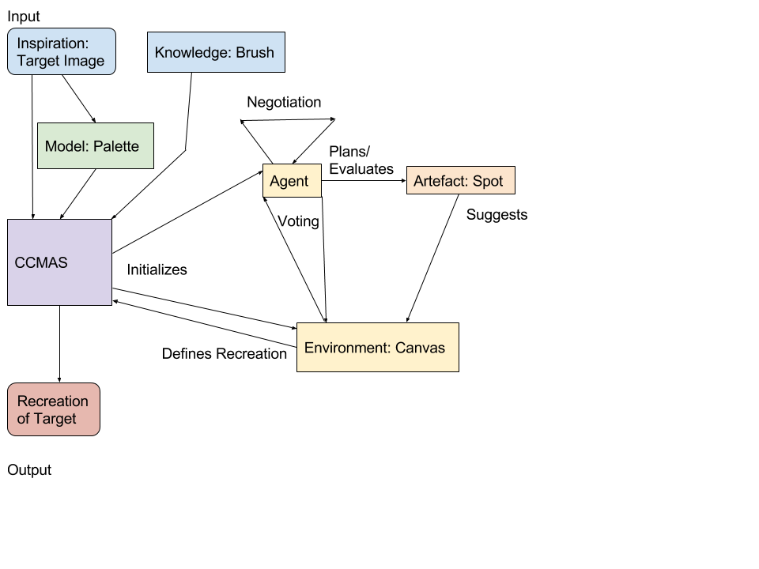
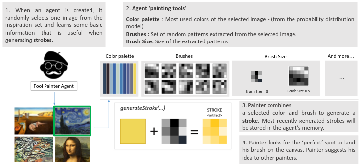
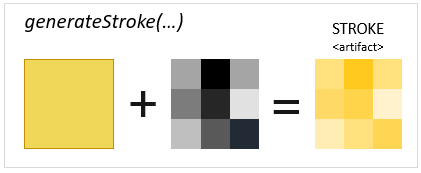

*************
Project goals
*************

The main goal of our project is to create a creative multi-agent system that paints images.

Each agent receives an image from the inspiring set. Based on the image (reference image), an agent generates a palette of colors and a set of brushes. A brush extracts information about patterns in the reference image, specifically about edges. The agent tries to recreate the target image using its tools.

Agents share a common canvas. In every iteration, each agent paints a stroke on the canvas using one of its brushes with a color from its palette. Every agent's goal is to propagate the style of 'his' image into the final painting.

Each agent is able to evaluate value, novelty and surprisingness of a stroke. The value is defined as a similarity of the stroke to the area of the image where stroke should be painted. The novelty is measured according to the position in target image. If there are already many strokes painted in that position, the novelty value is low. Surprisingness is defined as a similarity to strokes the agent has in its memory.

This process is visualised in the diagram.

Why is the system creative?
===========================

Even though each agent tries to recreate the target image which could be considered as a mere generation, we can say that the system as a whole is creative. 

Firstly, each agent tries to generalise the information that is contained in its reference image data. Agent extracts the most frequent colours in the reference image. Also, new strokes are not just parts of the reference image but instead they are expressed as brushes of various shapes.

Secondly, the target image is painted by a set of agents. These agents have different opinions on how the image should look like, but at the same time, they share a common evaluation scheme. This scheme ensures that the new image is valuable. Also as there are multiple agents in the system, a newly produced image should show novelty.

Elements of the system
======================

Agent
-----
* "Fool with brush".
* The process performed by an agent is visualised in the diagram below.

Artefact (= Stroke)
-------------------
* Modification of the shared canvas.
* A stroke is created by combining a brush with a colour from agent's palette.

Environment (= Canvas)
----------------------
* A shared canvas. Agents paint their strokes on the canvas.
* An agent tries to modify the canvas in a valuable and novel way. That means it tries to choose a spot on canvas that hasn't been used many times before. 

Memory model
------------
* The system uses a simple ListMemory model.
* Agent remembers last n strokes and try to avoid repetition of the same strokes.
* This is another source of novelty in the system.

Inspiring set
-------------
* A predefined set of reference images. An agent defines its brushes and palette based on an image from this set.
